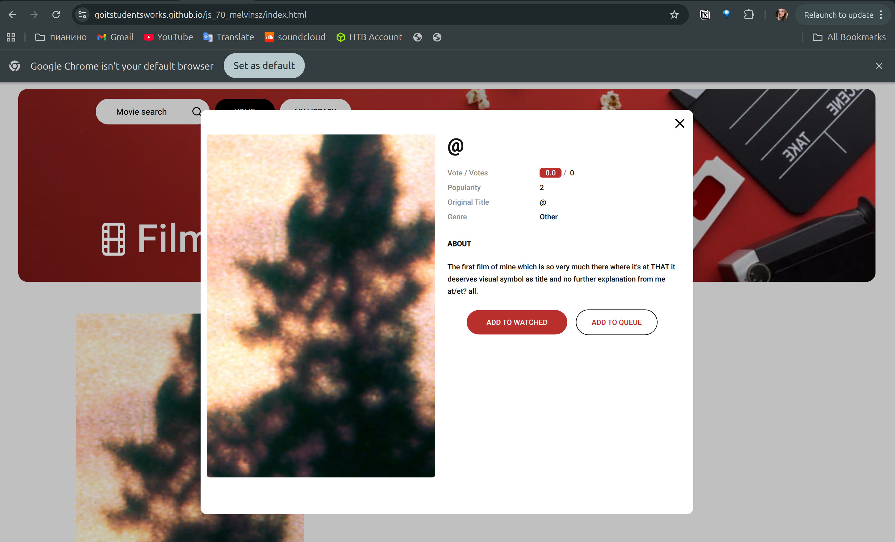

# BR-002 - Movie with invalid data is displayed in the movie list

### General Information

| Reporter | Assignee | Status | Type | Severity | Priority | Environment |
|------|-------|-------|-------|-------|-------|-------|
| Evnika S. | Developer 1 | New | Functional | Minor | Medium | Ubuntu 24.04.2 LTS   Google Chrome Version 139.0.7258.154 | 

### Description
A movie with an invalid title and incomplete metadata is displayed in the movie list and movie details modal.

| # | Precondition |
|---|-------------|
| 1 | Homepage is opened in the browser (https://goitstudentsworks.github.io/js_70_melvinsz/) |

| # | Step to reproduce |
|---|------|
| 1 | Write "@" in search bar |
| 2 | Click "Enter" |

### Expected result:
Movies displayed in the application contain valid, user-friendly data.

### Actual result:
A movie with the title "@" is displayed in the movie details modal. 
It contains zero votes, minimal popularity, and an unclear description.

---
### Attachments

| Attachments |
|-------------|
|  |
