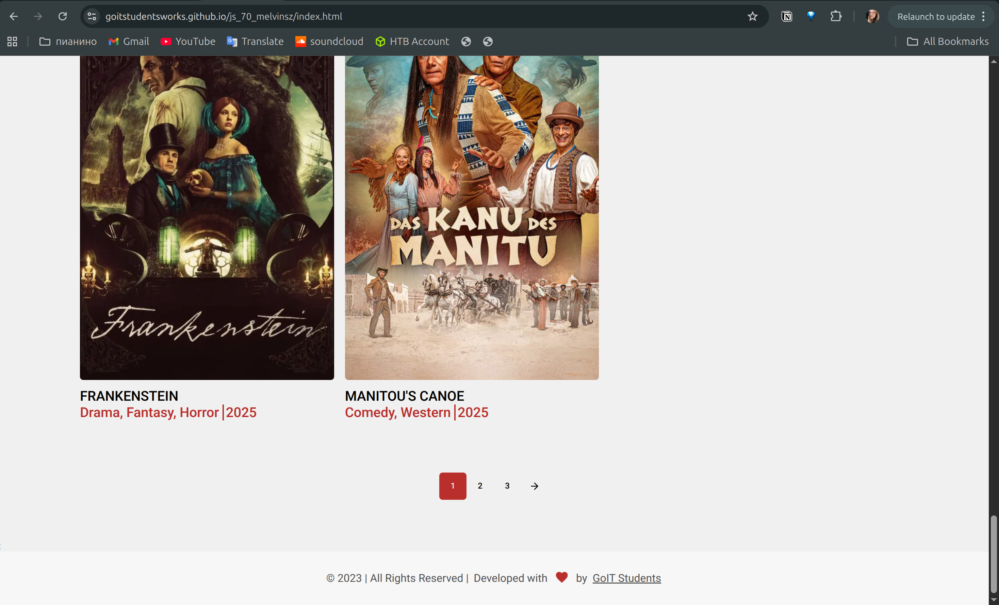

# BR-003 - Last movie card is not displayed in the grid

### General Information

| Reporter | Assignee | Status | Type | Severity | Priority | Environment |
|------|-------|-------|-------|-------|-------|-------|
| Evnika S. | Developer 1 | New | UI/UX | Minor | Low | Ubuntu 24.04.2 LTS   Google Chrome Version 139.0.7258.154 | 

### Description
The grid is not fulfilled by movies at the end of the page, even though the list has not ended.

| # | Precondition |
|---|-------------|
| 1 | Homepage is opened in the browser (https://goitstudentsworks.github.io/js_70_melvinsz/) |

| # | Step to reproduce |
|---|------|
| 1 | Slide down to the end of the list of movies |

### Expected result:
The grid of the page is fulfilled by movies in 3 columns.
### Actual result:
The last movie is absent, though the list has not ended.

---
### Attachments

| Attachments |
|-------------|
|  |
