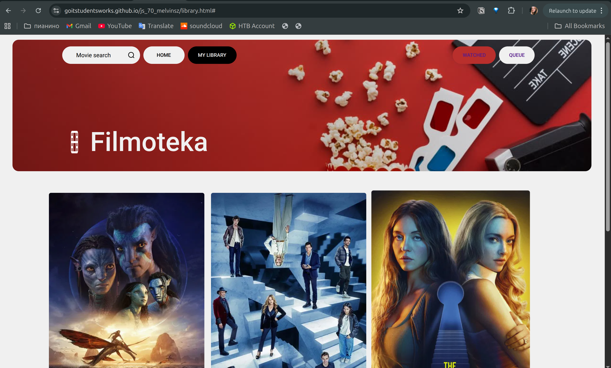

# BR-004 - Footer link “GoIT Students” triggers scroll-to-top instead of opening students list

### General Information

| Reporter | Assignee | Status | Type | Severity | Priority | Environment |
|------|-------|-------|-------|-------|-------|-------|
| Student A. | Developer 2 | New | Functional | Minor | Low | Ubuntu 24.04.2 LTS   Google Chrome Version 139.0.7258.154 | 

### Description
| # | Precondition |
|---|-------------|
| 1 | Website is opened in the browser (https://goitstudentsworks.github.io/js_70_melvinsz/) |

| # | Step to reproduce |
|---|------|
| 1 | Click on "MY LIBRARY" at the navbar at the top |
| 2 | Scroll down to the footer |
| 3 | Press on "GoIT Students" |

### Expected result:
Displays the list of the students
### Actual result:
Scrolls to top action activated

---
### Attachments

| Attachments |
|-------------|
|  |
