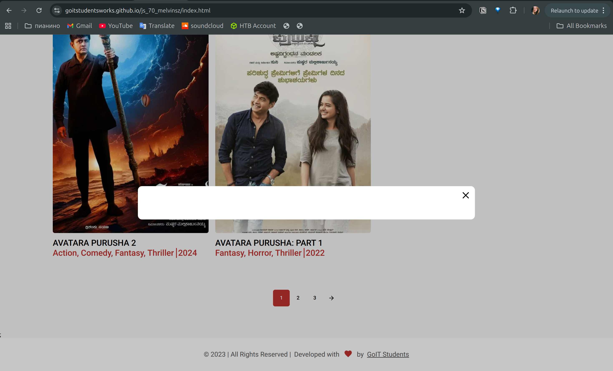

# BR-005 - Movie details modal window is empty

### General Information

| Reporter | Assignee | Status | Type | Severity | Priority | Environment |
|------|-------|-------|-------|-------|-------|-------|
| Student A. | Developer 54 | New | Functional | Minor | Medium | Ubuntu 24.04.2 LTS   Google Chrome Version 139.0.7258.154 | 

### Description
When clicking on a movie card, the movie details modal opens but the information section inside the modal is empty and does not display movie details.
| # | Precondition |
|---|-------------|
| 1 | Website is opened in the browser (https://goitstudentsworks.github.io/js_70_melvinsz/) |

| # | Step to reproduce |
|---|------|
| 1 | Find the movie "AVATARA PARUSHA 2" |
| 2 | Click on it |

### Expected result:
Displays info about the movie
### Actual result:
The field is empty

---
### Attachments

| Attachments |
|-------------|
|  |
